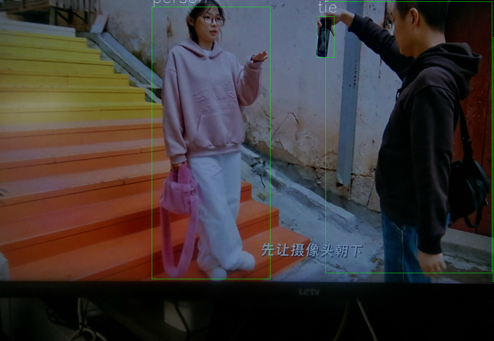

非常好，下面是**更新后的产品文档**，已加入你提供的**部署结构信息**和**项目源码说明**，格式清晰，适合用于内部技术交底、客户文档或上线交付说明。

---

## 实时监控与信息泄露检测系统产品文档

### 一、项目概述

本系统是一套集图像采集、AI目标检测、图像姿态分析、泄密预警、视频推流于一体的**边缘智能实时监控与信息安全检测平台**，基于瑞芯微 RV1126 芯片和 Sony IMX415 传感器开发，结合 FFmpeg + ZLMediaKit 推流架构，以及后端大模型辅助判断机制，帮助企业有效识别**疑似拍照泄密行为**，从而强化核心区域的保密管控。

---

### 二、系统功能流程

1. **视频采集**：IMX415 摄像头将 1920x1080 图像帧输入 RV1126；
2. **边缘检测**：每 15ms 进行一次图像检测，使用 YOLOv5 模型识别“人”和“手机”；
3. **行为判定**：若目标同时出现，进一步通过姿态估计判断是否为“拍照”行为；
4. **风险上报**：

   * 若满足风险条件，图像编码为 JPEG；
   * 携带目标检测信息调用 Java 接口；
   * Java 后台接入图像大模型，判断是否构成泄密风险；
5. **视频推流**：

   * 使用 FFmpeg 将实时图像编码为 H.264 并通过 RTSP 协议推送；
   * 推送至 ZLMediaKit，由其统一分发、支持多协议播放。

---

### 三、项目部署说明

#### 目录结构

```plaintext
project_root/
│
├── src/                # 源码目录
│   ├── main.cc             # 主程序入口
│   ├── rknn_yolo.c         # YOLOv5 模型推理逻辑
│   ├── tools.c             # 工具类函数（如时间戳、图像转换等）
│   ├── rtsp_push.c         # FFmpeg RTSP 推流模块
│   ├── rkmedia_vi_venc.c   # RKMedia 图像采集 + 编码模块
│   ├── buffer_pool.c       # 多线程安全缓冲区实现
│
├── include/            # 头文件目录
│   └── *.h             # 各模块对应头文件
│
├── rknn_models/        # 模型目录
│   ├── yolov5.rknn         # 目标检测模型文件
│   └── labels.txt          # 类别标签
│
├── rv1126/             # 引入的瑞芯微官方源码
│   └── ...             # RKMedia / RGA / DRMBuf 等接口封装
│
├── install/            # 可执行文件输出路径
│   └── monitor_detect   # 最终生成的程序
│
├── build.sh            # 一键编译脚本
└── README.md           # 项目说明文档
```

#### 编译方式

请确保已安装瑞芯微交叉编译工具链，并配置环境变量：

```bash
source /opt/rv1126_toolchain/env.sh
./build.sh
```

编译完成后，在 `install/` 目录下生成可执行程序 `monitor_detect`。

---

### 四、运行方式

1. 将模型文件（如 `rknn_models/yolov5.rknn`）拷贝到目标设备；
2. 执行程序：

```bash
./install/monitor_detect
```

系统自动加载模型、初始化摄像头、启动检测和推流逻辑。

---

### 五、系统关键模块说明

| 模块文件                    | 功能说明                            |
| ----------------------- | ------------------------------- |
| `src/main.cc`           | 主程序入口，初始化各模块，启动主循环              |
| `src/tools.c`           | 常用工具函数，如获取当前时间戳、RGB ↔ NV12 图像转换 |
| `src/rknn_yolo.c`       | 基于 RKNN API 执行 YOLOv5 推理        |
| `src/rtsp_push.c`       | 调用 FFmpeg 实现 RTSP 推流功能          |
| `src/rkmedia_vi_venc.c` | 使用 RKMedia 完成图像采集与 H.264 编码     |
| `src/buffer_pool.c`     | 线程安全缓冲池，实现采集、处理、推流解耦            |

---

### 六、技术选型说明：为何使用 FFmpeg + ZLMediaKit？

| 对比项  | 直接嵌入式推流            | FFmpeg 推流 + ZLMediaKit 分发       |
| ---- | ------------------ | ------------------------------- |
| 协议支持 | 需自行实现或改造（仅支持 RTSP） | 支持 RTSP / RTMP / HLS / WebRTC 等 |
| 并发性能 | 嵌入式负载大，性能有限        | 推流只需一次，ZLMediaKit 支持高并发转发       |
| 安全性  | 无鉴权控制              | 支持访问控制、日志、安全策略                  |
| 维护扩展 | 分发逻辑嵌入程序，难以维护      | 解耦分发逻辑，服务端集中管理                  |
| 成本对比 | 初期开发简单，但长期维护复杂     | 初期部署稍复杂，长期稳定性好                  |

✅ 采用 **FFmpeg + ZLMediaKit**，是一种成熟、安全、可扩展的工业级视频分发方案。

---

### 七、系统优势

* ✅ **毫秒级延迟**采集与分析，满足对实时性的极高要求
* ✅ **边缘智能分析 + 云端大模型辅助判断**，提升安全准确性
* ✅ **抓拍图像、检测信息主动上报**，支持接入企业安全管理系统
* ✅ **可嵌入多种场景部署**，适用于会议室、研发中心、厂区等
* ✅ **软硬解耦、可扩展性强**，后续可升级更多模型或改进推流方式

---

### 八、典型应用场景

* 企业会议室防偷拍监管
* 实验室、测试车间敏感区域监控
* 展厅/展馆内禁止拍照区域自动预警
* 数据中心、服务器机房非授权拍摄防控

---

### 九、项目开源地址
[https://github.com/busizeshi/real-time-intelligent-monitoring.git]

### 十、demo展示

